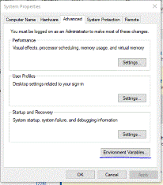
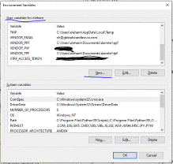

# Oppskrift installere simpleVP

## 1. Installer Python.

[__Last ned Python fra den offisielle siden__](https://www.python.org/downloads/windows/). Jeg anbefaler versjon 7.9, det er ikke nødvendig med noe nyere enn det. 
Under installasjonen bør du tenke på følgende:

* Installer i en mappe utenfor det låste filsystemet \(f.eks. C:\\Python\)
* Se etter et valg om «Add Python to Path» eller lignende. Klikk for JA!
* Se etter et valg om å installere **tkc/tkinter**. Klikk for JA!

## 1. Pakk ut programmet
Det ligger lagret her: R:\\Filutväxling\\Ole\\simplevp3.zip. 
Pakk det ut der du har grei tilgang på det.
Kjør den filen som heter `create_database_for_simplevp.py`. 
Om alt gikk bra, skal du nå ha fått en fil som heter «simpleVP.db» i mappen din.
Det er databasen din. 
Du kan egentlig bare slette «create_database_for_simplevp.py» nå.

Til slutt bør du ha disse filene i mappen din:

> README.md
>
> filehandling.py
>
> img
>
> sQLiteClass.py>
>
> simpleVP.py
>
> simpleVP.db

## 2. Åpne CMD i admin-modus
Enkleste metoden er å trykke `Win + R`, skrive «cmd» og så trykke `Ctrl+Shift+Enter`. 
Ev. kan du søke etter «cmd» i søkefeltet, høyreklikke og velge "Åpne ledetekst som admin"
Prompten skal stå i «system32» om du har gjort det riktig. 
Skriv inn følgende kommandoer, uten sitattegn og etterfulgt av Enter:

> `pip install pillow`
>
> `pip install tkcalendar`
>
> `pip install requests`

Om alt gikk bra, kan du stenge ledeteksten og gå videre til neste trinn. 
Hvis ikke, si ifra.

## 3. Trykk på «simpleVP.py» 
for å sjekke at programmet åpner seg som det skal. 
Om programmet åpner seg, er alt riktig så langt. 
Nå må du definere to mapper, én for å lagre TPF-er i og én for å lagre PPF-er i.

## 4. Opprett to mapper til lokal lagring.
F.eks. 

> <..>\\daimler\\ppf 
>
> <..>\\daimler\\tpf

eller lignende!
Du kan også bruke eksisterende mapper, men hver oppmerksom på at PPF-mappen «renses» hver gang du laster ned nye filer, så den inneholder kun filene som ble lastet ned sist.
	
## 5. Redigere miljøvariabler
For å unngå å måtte fylle ut skjemaet i simpleVP hver gang du starter det, har du muligheten til å definere e-post, passord, ppf-mappe og tpf-mappe i miljøvariablene dine.
For å enkelt redigere miljøvariablene, trykk på `Win+S` og søk etter «miljøvariabler».

Under «Brukervariabler for XXX» (øverste vindu) skal du trykke på ny eller new.
Som variabelnøkkel skal du oppgi et spesifikt ord du finner under. 
Som variabelverdi skal du oppgi hhv. e-post, passord, ppf- eller tpf-mappe.
Etter følgende mønster:

> VENOR\_XTRF="https://xtrf.company.com"
>
>VENDOR\_EMAIL="your@email.com" 
>
> VENDOR\_PW="your password" 
>
> VENDOR\_PPF="the folder used for storing PPF" 
>
> VENDOR\_TPF="the folder used for storing TPF"

MERK: du MÅ strengt tatt ikke gjennomføre dette trinnet. Bare la være å oppgi passord i miljøvariablene om du helst ikke vil skrive det noe sted. Du må da til gjengjeld oppgi passordet hver gang. 

## 6. Det burde være alt.
Om du vil få en veldig nice synergieffekt, stiller du inn «Projekt entpacken» på PPF-mappen og "Uebersetzung packen" på TPF-mappen.
simpleVP vil automatisk laste ned filer til PPF-mappen.
Den vil automatisk finne de riktige filene dersom de er lagret i TPF-mappen.
